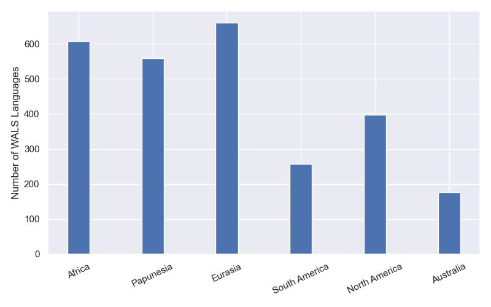
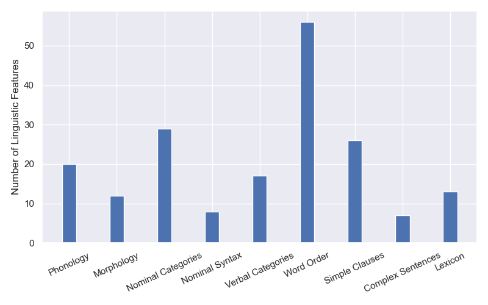
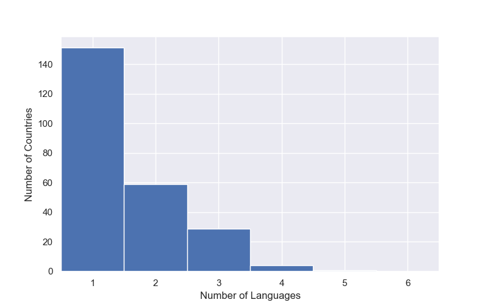

# Project of Data Visualization (COM-480)

| Student's name | SCIPER |
| -------------- | ------ |
| Dimitrios Samakovlis | 343163 |
| Rafael Medina Morillas | 323035 |
| Christodoulos Kechris | 343484 |

## Milestone 1 (29th March, 5pm)

### Introduction

There are estimated to be over 7,000 languages spoken worldwide. Studying language diversity across the world is essential for understanding the intricacies of human communication and the cultural richness of societies. Each language is a unique window into the collective knowledge, history, and identity of its speakers. By delving into the vast array of languages spoken globally, researchers can uncover invaluable insights into human cognition, social interaction, and the evolution of languages over time. Furthermore, investigating language diversity fosters appreciation and respect for different cultures, promoting inclusivity and cross-cultural understanding. Ultimately, research in this field not only enriches our understanding of humanity but also provides practical benefits in areas such as education, translation, and global cooperation.

### Dataset
Our main dataset is the [**World Atlas of Language Structures (WALS)**](https://www.kaggle.com/datasets/rtatman/world-atlas-of-language-structures) from Kaggle. WALS is a large database of structural (phonological, grammatical, lexical) properties of languages gathered from descriptive materials (such as reference grammars) by a team of 55 authors. The atlas provides information on the location, linguistic affiliation and basic typological features of a great number of the world's languages. There are over 200 features examined for each language enabling a lot of opportunities for data analysis and visualization. 
WALS Online is a publication of the [Max Planck Institute for Evolutionary Anthropology](http://www.eva.mpg.de/). It is a separate publication, edited by Dryer, Matthew S. & Haspelmath, Martin (Leipzig: Max Planck Institute for Evolutionary Anthropology, 2013).

Our secondary dataset is the [**Countries Info**](https://www.kaggle.com/datasets/pragya1401/countries-info). This dataset allows us to map a language from WALS to multiple countries that speak the same language. This was a limitation of the WALS dataset which would not allow us to visualize characteristics of a language to all countries that currently use this language.

### Overview

##### Motivation and target audience
Working in an interdisciplinary environment and interacting with people in a multicultural context has planted the seed of curiosity for exploring various cultures into us. Our main focus over the last two years was learning how to translate common expressions from our mother tongue to other languages, as well as how different languages are structured syntactically and grammatically. As a result, we are intrinsically curious about exploring languages in depth and understanding similarities and differences among them. 

Visualizing linguistic datasets offers a powerful means to unravel the intricate patterns and structures embedded within the world's diverse languages. By employing data visualization techniques, we can enable the identification of trends, correlations, and anomalies with ease. These visualizations not only facilitate the exploration of linguistic diversity but also provide valuable insights into language evolution, contact, and variation across different regions and communities. Thus, investing in the visualization of linguistic datasets not only enhances our understanding of language dynamics but also promotes interdisciplinary collaboration and knowledge dissemination in the field of linguistics.

##### Approach
The main task of our visualization attempts will be to show conceptual similarities among widespread languages and their correlation to the geographical position of each language's origin place. To achieve this we are planning to cluster features based on similarity of concept (e.g. consonant-vowel cluster includes 3 features: (i) vowel consonant inventories, (ii) vowel quality inventories, and (iii) Consonant-vowel Ratio). Then based on the clustered features we can explore similarity among languages and similarity among geographical locations.

### Exploratory Data Analysis

Dataset 1 : World Atlas Of Language Structures

The WALS dataset contains 2679 languages and dialects grouped into 256 Language Families. The languages are grouped into 6 geographical regions with Eurasia containing the most documented languages and Australia the least:

Overall, a set of 202 available features provides a rich multifaceted description for each language. These language features can be grouped into 9 categories, each describing a different aspect of the language:

Interestingly, not all languages have been documented to the scame extend. The distribution of available features per language is presented below: 

Dataset 2 : Countries Info

This dataset contains information from 250 countries and regions. Specifically we are interested in the main languages spoken in each country. In most cases only the prominent language is only one, however nearly a quarter of the countries have two:

### Related work

The original dataset is published as an online resource ([The World Atlas of Language Structures Online](https://wals.info/)). It contains the description of the different analyzed features and  world maps showcasing them with reduced interactivity. There are also limited genealogy and geographic visualizations.

[R. Littauer et al.](https://www.researchgate.net/publication/261363057_Visualising_Typological_Relationships_Plotting_WALS_with_Heat_Maps) tried to visualize typological relationships with heatmaps. Differently, the [WALS Sunburst Explorer](https://github.com/tmayer/WALSvis) plots the language features using sunburst visualizations to combine geolocation and genealogy. In a [blog post](http://lkozma.net/blog/languages-visualization/), László Kozma tries to visualize the romance languages in U-matrix format.

In our visualization we will try to show the geographical and genealogical relationships between languages by showing their similarities and correlation between features. We will allow to visualize by genuses and families. We will also employ the second dataset to show visualizations where the language sample are reduced to the official languages of the different countries. 

By looking at the [D3 gallery](https://observablehq.com/@d3/gallery) we found some interesting ways to show:
- Genealogy (Treemap, circle packing, sunburst)
- Geography (Choropleth, Zoom to bounding box)
- Relationships (Chord diagram)
